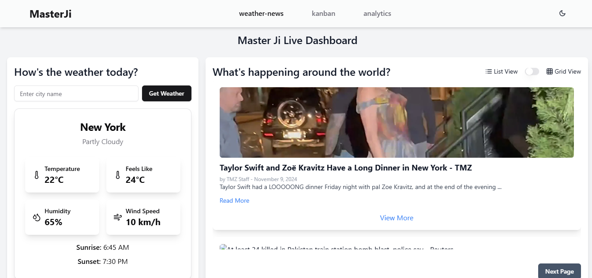
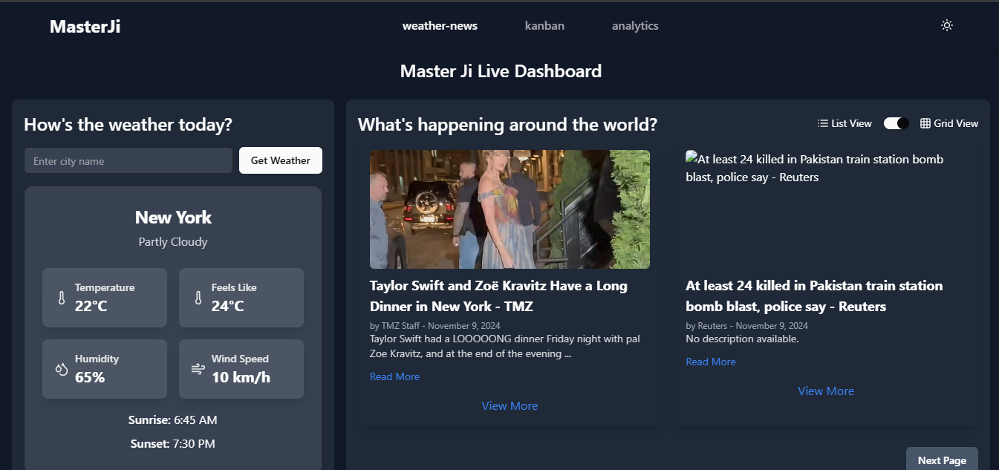
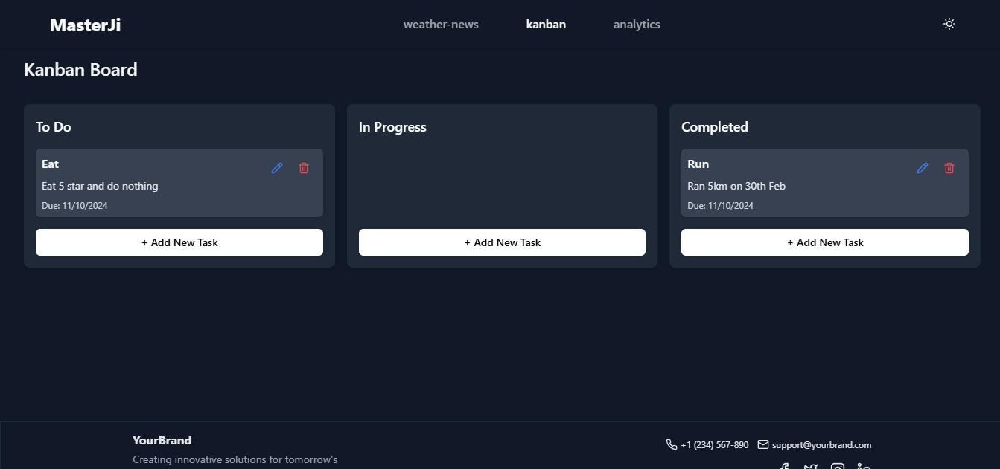
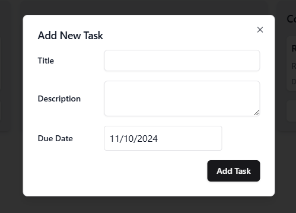
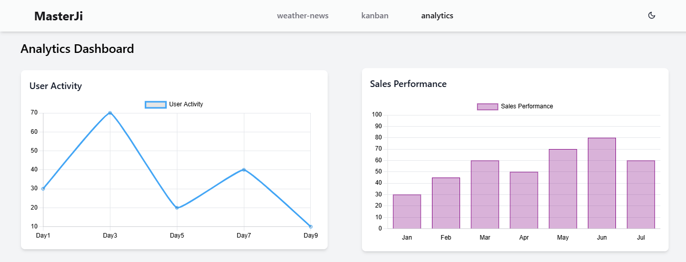
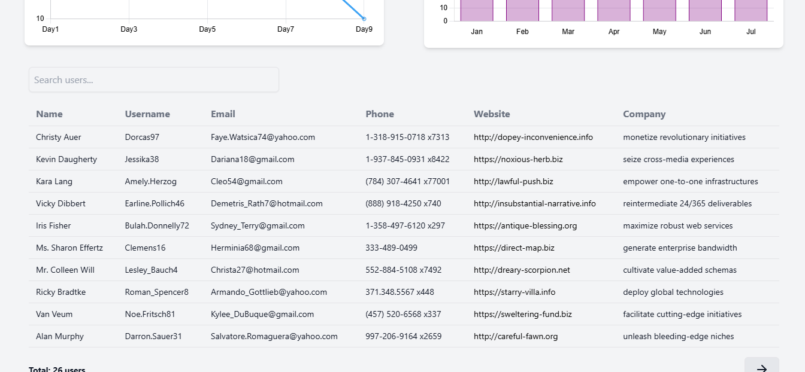
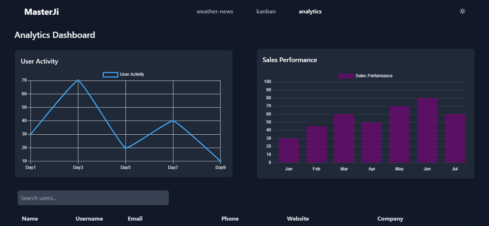

A Next.js web application that integrates weather news, a Kanban board, and analytics dashboards with charting and task management functionalities. This project features responsive design, dark mode support, and local storage persistence.

## 🚀 Built With

- **Frontend Framework:** Next.js v15
- **Styling:** Tailwind CSS
- **UI Components:** Shadcn UI
- **API Handling:** Axios
- **Drag-and-Drop:** @hello-pangea/dnd
- **Charts:** Chart.js
- **Persistence:** LocalStorage for Kanban state

## 📍 Routes

### Weather News (`/dashboard/weather-news`)

This route displays the weather of any city and includes a news dashboard feature with a toggle between list view and grid view. It also supports dark mode with proper error handling.

#### Features

- **Weather Information:** Displays weather data for any city
- **News Dashboard:** Toggle between list view and grid view for news
- **Dark Mode:** Seamless dark mode support
- **Error Handling:** Proper error handling for city search and API responses





### Kanban Board (`/dashboard/kanban`)

This route features a drag-and-drop Kanban board for task management.

#### Features

- **Drag-and-Drop:** Implemented using the Hello Pangea DnD library
- **Columns:** Default columns include "To Do," "In Progress," and "Completed"
- **Task Management:** Users can create, edit, drag, and move tasks between columns
- **LocalStorage Persistence:** The board's state is saved in localStorage to persist data across page reloads
- **Responsive Design:** Adapts well to different screen sizes, including mobile views





### Analytics Dashboard (`/dashboard/analytics`)

This page displays visual data using charts and a dynamic table.

#### Features

- **Charts Section:**
  - **Line Chart:** Displays user active user trends
  - **Bar Chart:** Shows monthly sales performance
- **Dynamic Table:**
  - **Data Population:** Uses a mock API to populate user data
  - **Pagination, Search, and Filtering:** Allows users to search, filter, and navigate data
  - **Table Structure:** Custom table component with proper separation of header, body, and footer elements
  - **Loading State:** Displays a loading indicator while fetching data





## ⚙️ Project Setup

### 1. Clone the Repository

```bash
git clone <repository-url>
cd <project-folder>
```

### 2. Install Dependencies

```bash
npm install
```

### 3. Environment Variables

Create a `.env.local` file in the root of your project and add the following environment variables:

```env
NEXT_PUBLIC_WEATHERAPI_URL=' '
NEXT_PUBLIC_WEATHERAPI_KEY=' '
NEXT_PUBLIC_NEWSAPI_URL=' '
NEXT_PUBLIC_USERSAPI_URL=' '
NEXT_PUBLIC_NEWSAPI_KEY=' '
```

### 4. Run the Development Server

```bash
npm run dev
```

The app should be running at [http://localhost:3000](http://localhost:3000).

## 🌐 Deployment

You can view the deployed version of this project here: [Deployed Application Link]()